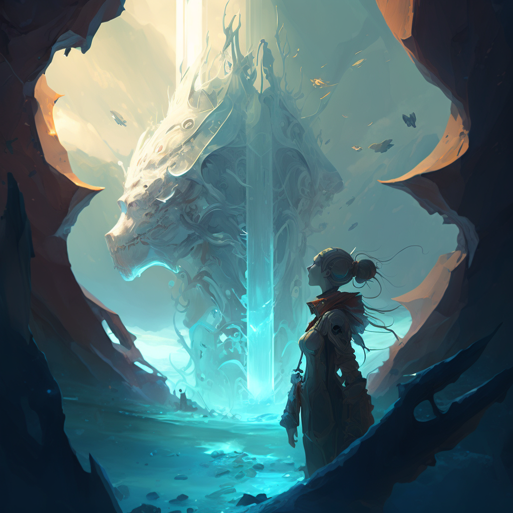
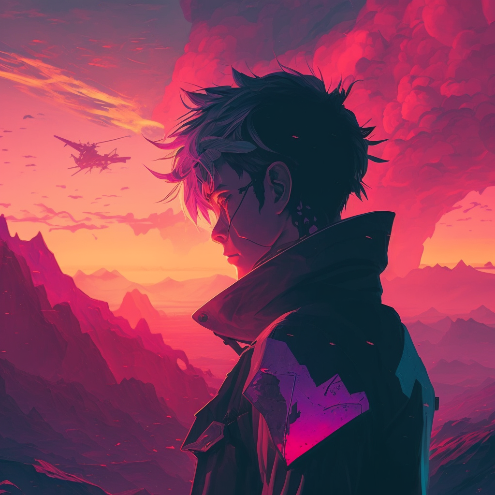
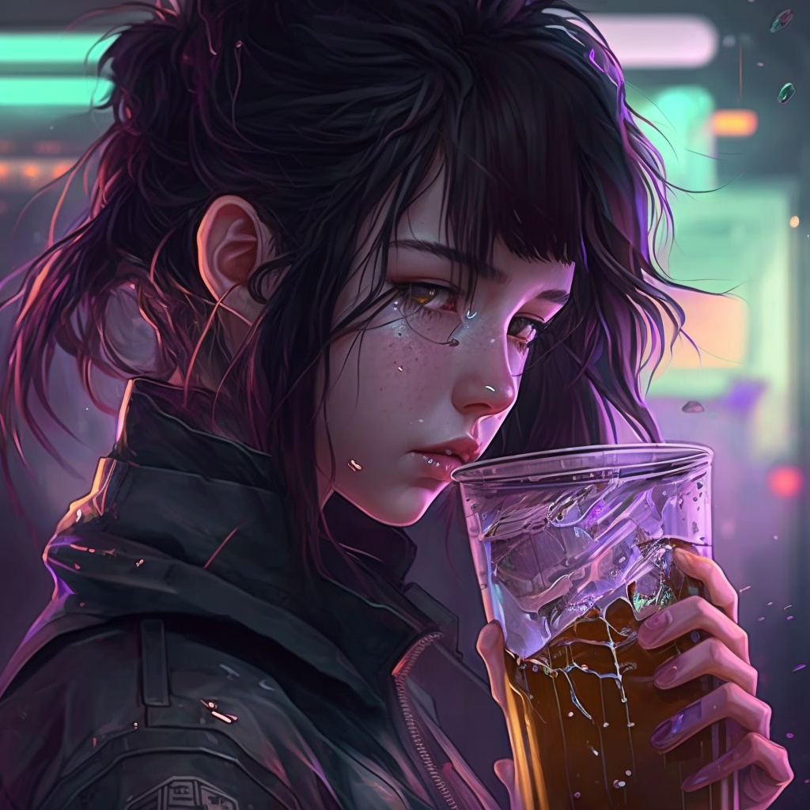

<h2 align="center">
    <p>Midpoint Mastery</p>
</h2>
<h3 align="center">
    <p>Simple prompt generation script for Midjourney, DALLe, Stable and Disco diffusion and etc neural networks.</p>
</h3><br>

## <p align="center">Quick start</p>

_Website: https://midpoint-mastery.vercel.app/_

## Available Scripts

In the project directory, you can run:

### `npm start`

Runs the app in the development mode. Open [http://localhost:3000](http://localhost:3000) to view it in your browser.

The page will reload when you make changes. You may also see any lint errors in the console.

### `npm test`

Launches the test runner in the interactive watch mode. See the section about [running tests](https://facebook.github.io/create-react-app/docs/running-tests) for more information.

### `npm run build`

Builds the app for production to the `build` folder.

It correctly bundles React in production mode and optimizes the build for the best performance. The build is minified and the filenames include the hashes.

## <p align="center">Example</p>

Version 0.1:
1. Midjourney
```
"galaxy, art by ismail inceoglu, render, detailed, photorealistic, photorealistic dramatic anime boy, trending on pixiv, full hd, magic circle, landscape, photorealistic, sunsets, flowers, global illumination, block cities, digital painting, mirrors"
```


2. Midjourney
```
"vray render, art by cory loftis, cinematic, landscape, fanart, Animal T-Shirt Design, Vector Illustrations, glitch art, art by makoto shinkai, art by atey ghailan, 8k, photorealistic dramatic, art by wlop, Japenese light novel, creepy, post-apocalypse, mirrors"
```


3. Midjourney
```
"by peter mohrbacher,  hdr, Sunsets, artstation, 4k 3d, by wayne barlowe,  rossdraws global illumination, terragen, hyper detailed, Animal T-Shirt Design, art by atey ghailan, battle field, epic, art by craig mullins, full hd, by craig mullins, Anime / Manga"
```


Version 0.2:
1. Midjourney
```
"fanbox, drawing, 4-bit, wet paint, weta FX, by wlop, art by Ko Young Hoon, art by craig mullins, beautiful lighting, by hajime sorayama,  Octal, puffy paint, volumetric lighting, art by atey ghailan, tones of black, by Ralph Steadman, logo"
```


2. Midjourney
```
"erode, vertex, modeling, subdimensional, convex, terragen, storybook illustration, bussiness card, crosshatch, vfx, GLSL shaders, by makoto shinkai, rossdraws global illumination"
```


3. Midjourney
```
"by atey ghailan, cinematic, radiant light, rose, scrapbooking, by peter mohrbacher,  12-bit, flowers, postage stamp, post-apocalypse, character design, art by john Constable, fanbox"
```


4. Midjourney
```
"light painting, art by john kenn mortense, baroque, art nouveau, space, neon, telephoto, cyclic, art by lemma guya, radiant light, light nover, vray render, unreal engine, tornadic"
```


# <p align="center">For more example going on:</p>
<h3 align="center">
	<a href="https://youtube.com/@Barkerbg001Shorts" target='_blank'>YouTube</a><br>
	<a href="https://www.instagram.com/barkerbg001" target='_blank'>Instagram</a><br>
</h3>